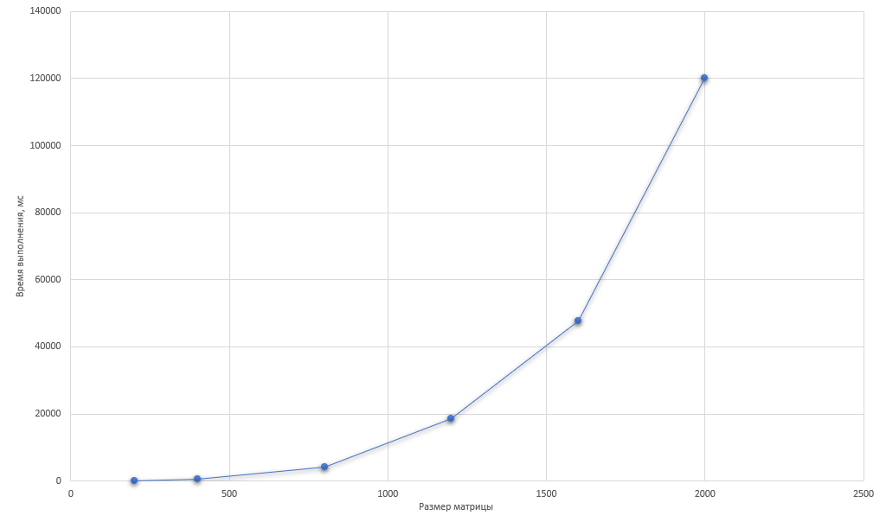

# Отчёт по лабораторной работе №1
## Умножение квадратных матриц (классический алгоритм)

**Выполнил:** Палагин Ярослав  
**Группа:** 6211-100503D  
**Дата:** 22.02.2024

---

## 1. Постановка задачи

Реализовать программу на языке C++ для умножения двух квадратных матриц классическим алгоритмом. Провести экспериментальное исследование зависимости времени выполнения от размера матриц.

**Требования:**
- Чтение матриц из файлов
- Запись результата в файл
- Измерение времени выполнения
- Автоматическая верификация с помощью Python (NumPy)
- Проведение экспериментов для размеров: 200, 400, 800, 1200, 1600, 2000

---

## 2. Характеристики системы

| Компонент | Характеристика |
|-----------|---------------|
| Процессор | AMD Ryzen 9 3900X 12-Core Processor(3.80 GHz) |
| Оперативная память | 16 GB |
| Компилятор | g++ (MinGW) |
| Флаги компиляции | -O2 |
| ОС | Windows |

---

## 3. Результаты экспериментов

### Таблица результатов

| Размер матрицы (n) | Время выполнения (мс) | Количество операций |
|-------------------|----------------------|---------------------|
| 200 | 61 | 16 000 000 |
| 400 | 529 | 128 000 000 |
| 800 | 4 282 | 1 024 000 000 |
| 1200 | 18 606 | 3 456 000 000 |
| 1600 | 47 611 | 8 192 000 000 |
| 2000 | 120 168 | 16 000 000 000 |

### График зависимости времени от размера матрицы

*Рисунок 1 – Зависимость времени выполнения от размера матрицы*

---

## 4. Выводы

1. **Корректность реализации:** Программа правильно умножает матрицы всех исследованных размеров, что подтверждено верификацией с NumPy.

2. **Временная сложность:** Экспериментально подтверждена кубическая сложность O(n³) классического алгоритма умножения матриц. При увеличении размера с 200 до 400 (в 2 раза) время выросло в 8.67 раз, что близко к теоретическому значению (8 раз).

3. **Производительность:** 
   - Наибольшая производительность достигнута на матрице 200×200
   - С ростом размера производительность падает из-за ограничений кэш-памяти

4. **Практические ограничения:**
   - При n=2000 время выполнения составляет ≈2 минуты
   - Объём памяти: три матрицы 2000×2000 занимают ≈96 МБ

5. **Пути улучшения:**
   - Распараллеливание вычислений (OpenMP)
   - Использование блочного умножения для лучшего использования кэша