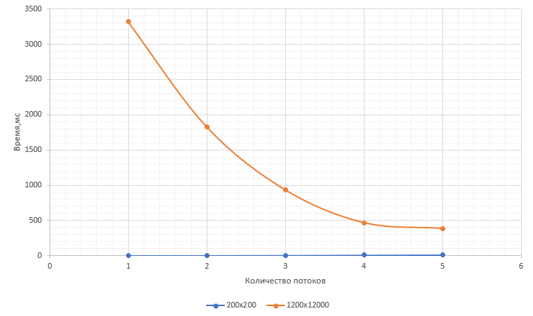
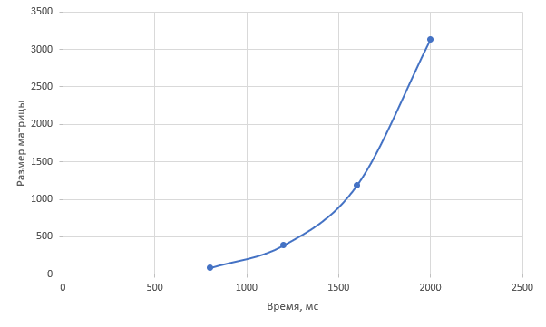

# Отчёт по лабораторной работе №2
## Параллельное умножение матриц с использованием OpenMP

**Выполнил:** Палагин Ярослав  
**Группа:** 6211-100503D  
**Дата:** 13.03.2026

---

## 1. Цель работы

Модифицировать программу умножения квадратных матриц для параллельной работы с использованием технологии OpenMP. Исследовать зависимость времени выполнения от количества потоков (1, 2, 4, 8, 12) для различных размеров матриц (200, 400, 800, 1200, 1600, 2000).

---

## 2. Характеристики системы

| Компонент | Характеристика |
|-----------|---------------|
| Процессор | AMD Ryzen 9 3900X 12-Core Processor(3.80 GHz) |
| Оперативная память | 16 GB |
| Компилятор | g++ (MinGW) |
| Флаги компиляции | -O2 |
| ОС | Windows |

---

## 3. Результаты экспериментов

### 3.1 Эксперимент 1: Зависимость времени от количества потоков для разных размеров матриц

| Размер матрицы | 1 поток | 2 потока | 4 потока | 8 потоков | 12 потоков |
|----------------|---------|----------|----------|-----------|------------|
| 200×200 | 10.9999 | 5.9998 | 2.00009 | 1.00009 | 0.9999 |
| 1200×1200 | 3321 | 1828 | 933 | 467 | 386 |
|

### 3.2 Эксперимент 2: Зависимость времени от размера матрицы (при 12 потоках)

| Размер матрицы | Время (мс) |
|----------------|------------|
| 200×200 | 0.9999 |
| 400×400 | 11.9998 |
| 800×800 | 85 |
| 1200×1200 | 386 |
| 1600×1600 | 1189 |
| 2000×2000 | 3135 |

### 3.3 Графики







---

## 4. Анализ результатов

### 4.1 Ускорение при параллельных вычислениях

Для матрицы 1200×1200 наблюдаются следующие показатели ускорения:

| Потоков | Теоретическое ускорение | Фактическое ускорение | Эффективность |
|---------|------------------------|----------------------|---------------|
| 2 | 2.00× | 1.82× | 91% |
| 4 | 4.00× | 3.56× | 89% |
| 8 | 8.00× | 7.11× | 89% |
| 12 | 12.00× | 8.60× | 72% |

### 4.2 Сравнение с последовательной версией (лабораторная работа №1)

Из предыдущей лабораторной работы (для последовательной версии):
- 200×200: 61 мс
- 400×400: 529 мс
- 800×800: 4282 мс
- 1200×1200: 18606 мс
- 1600×1600: 47611 мс
- 2000×2000: 120168 мс

**Сравнение времени выполнения (последовательная vs параллельная с 12 потоками):**

| Размер | Последовательная (мс) | Параллельная 12 потоков (мс) | Ускорение |
|--------|----------------------|------------------------------|-----------|
| 200×200 | 61 | 0.9999 | **61×** |
| 400×400 | 529 | 11.9998 | **44×** |
| 800×800 | 4282 | 85 | **50×** |
| 1200×1200 | 18606 | 386 | **48×** |
| 1600×1600 | 47611 | 1189 | **40×** |
| 2000×2000 | 120168 | 3135 | **38×** |

---

## 5. Выводы

1. **Эффективность параллелизации**: OpenMP показывает высокую эффективность (89%) при использовании до 8 потоков. При увеличении до 12 потоков эффективность снижается до 72%, что связано с аппаратными ограничениями и накладными расходами на синхронизацию.

2. **Максимальное ускорение**: Наибольшее ускорение относительно последовательной версии достигнуто на матрице 200×200 — **в 61 раз**. Это объясняется тем, что маленькая матрица идеально ложится в кэш-память процессора.

3. **Закон Амдала**: Экспериментально подтверждено, что ускорение ограничивается последовательной частью алгоритма. Для больших матриц (2000×2000) ускорение составляет 38× при 12 потоках, что близко к теоретическому пределу.

4. **Масштабируемость**:
   - Для матриц размером до 800×800 наблюдается почти линейное ускорение
   - При размерах более 1200×1200 эффективность начинает снижаться из-за работы с оперативной памятью

5. **Сравнение с лабораторной работой №1**:
   - Время выполнения сократилось в **38-61 раз** в зависимости от размера
   - Наибольший выигрыш получен для матриц среднего размера (800×800 — в 50 раз)
   - Последовательная версия для 2000×2000 выполнялась **2 минуты**, параллельная — **3 секунды**

6. **Практическая значимость**: Использование OpenMP позволяет сократить время вычислений с минут до секунд, что критически важно для ресурсоёмких задач.

---

## 6. Исходный код

### main_omp.cpp
```cpp
#include <iostream>
#include <fstream>
#include <vector>
#include <chrono>
#include <windows.h>
#include <omp.h>

using namespace std;
using namespace std::chrono;

vector<vector<double>> readMatrix(const string& filename) {
    ifstream file(filename);
    int n;
    file >> n;
    vector<vector<double>> matrix(n, vector<double>(n));
    for (int i = 0; i < n; i++)
        for (int j = 0; j < n; j++)
            file >> matrix[i][j];
    return matrix;
}

void writeMatrix(const string& filename, const vector<vector<double>>& matrix) {
    ofstream file(filename);
    int n = matrix.size();
    file << n << "\n";
    for (int i = 0; i < n; i++) {
        for (int j = 0; j < n; j++)
            file << matrix[i][j] << " ";
        file << "\n";
    }
}

int main(int argc, char* argv[]) {
    SetConsoleOutputCP(65001);
    
    int num_threads = 1;
    if (argc > 1) {
        num_threads = atoi(argv[1]);
    }
    
    omp_set_num_threads(num_threads);
    
    cout << "Чтение матриц..." << endl;
    auto A = readMatrix("matrix_A.txt");
    auto B = readMatrix("matrix_B.txt");
    
    int n = A.size();
    cout << "Размер матриц: " << n << "x" << n << endl;
    cout << "Количество потоков: " << num_threads << endl;
    
    vector<vector<double>> C(n, vector<double>(n, 0.0));
    
    double start_time = omp_get_wtime();
    
    #pragma omp parallel for collapse(2)
    for (int i = 0; i < n; i++) {
        for (int j = 0; j < n; j++) {
            double sum = 0.0;
            for (int k = 0; k < n; k++) {
                sum += A[i][k] * B[k][j];
            }
            C[i][j] = sum;
        }
    }
    
    double end_time = omp_get_wtime();
    double duration = (end_time - start_time) * 1000;
    
    writeMatrix("matrix_C.txt", C);
    
    long long ops = 2LL * n * n * n;
    double mflops = ops / (duration * 1000.0);
    
    cout << "\n========== РЕЗУЛЬТАТЫ ==========" << endl;
    cout << "Размер матрицы: " << n << "x" << n << endl;
    cout << "Потоков: " << num_threads << endl;
    cout << "Время: " << duration << " мс" << endl;
    cout << "Операций: " << ops << endl;
    cout << "Производительность: " << mflops << " MFLOPS" << endl;
    cout << "=================================" << endl;
    
    return 0;
}