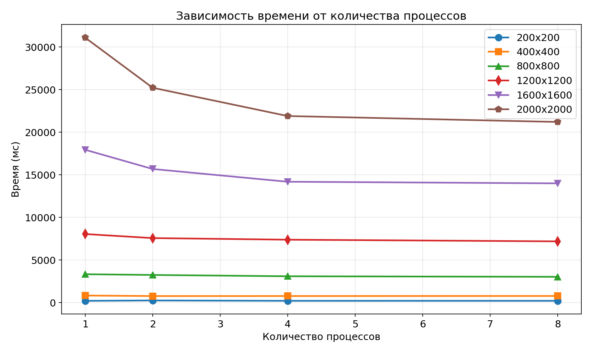
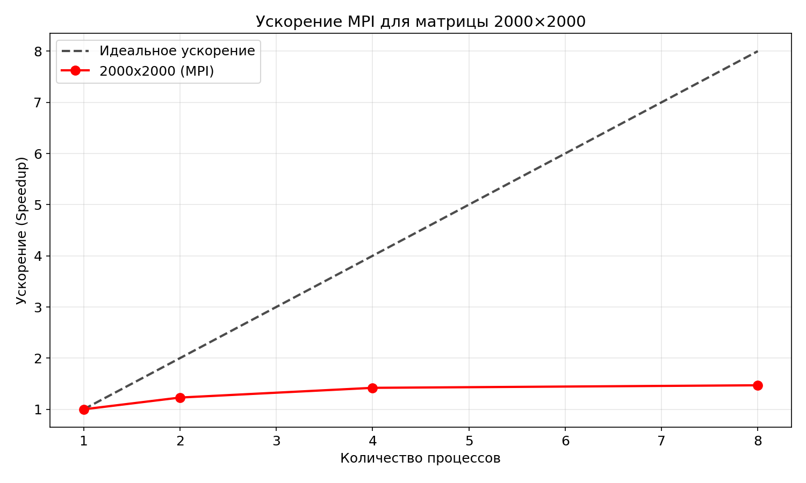
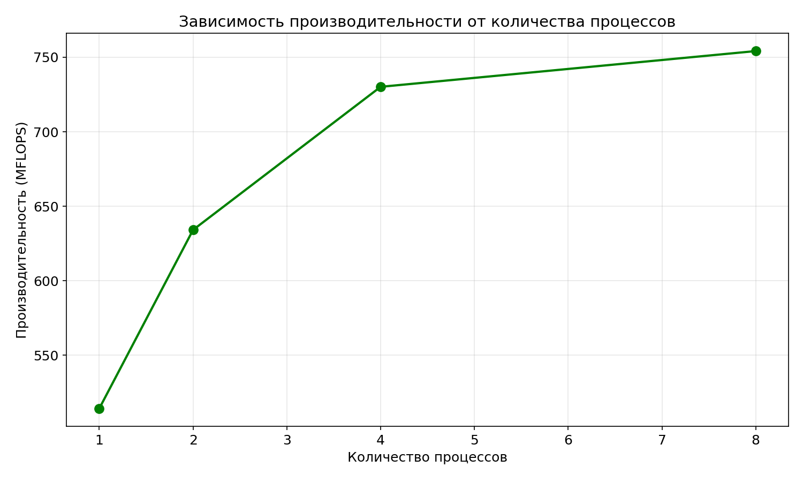

# Отчёт по лабораторной работе №3
## Параллельное умножение матриц с использованием MPI

**Выполнил:** Палагин Ярослав  
**Группа:** 6211-100503D  
**Дата:** 13.03.2026

---

## 1. Цель работы

Модифицировать программу умножения квадратных матриц для параллельной работы с использованием технологии OpenMP. Исследовать зависимость времени выполнения от количества потоков (1, 2, 4, 8, 12) для различных размеров матриц (200, 400, 800, 1200, 1600, 2000).

---

## 2. Характеристики системы

| Компонент | Характеристика |
|-----------|---------------|
| Процессор | AMD Ryzen 9 3900X 12-Core Processor(3.80 GHz) |
| Оперативная память | 16 GB |
| Компилятор | g++ (MinGW) |
| Флаги компиляции | -O2 |
| ОС | Windows |

---


## 3. Результаты экспериментов

### 3.1 Таблица времени выполнения (мс)

| Размер | 1 процесс | 2 процесса | 4 процесса | 8 процессов |
|--------|-----------|------------|------------|-------------|
| 200×200 | 216.17 | 260.74 | 219.81 | 220.77 |
| 400×400 | 840.40 | 780.07 | 782.24 | 788.94 |
| 800×800 | 3341.56 | 3255.30 | 3102.26 | 3037.40 |
| 1200×1200 | 8059.25 | 7583.32 | 7395.50 | 7199.97 |
| 1600×1600 | 17952.2 | 15695.1 | 14198.4 | 14009.3 |
| 2000×2000 | 31116.6 | 25232.4 | 21912.6 | 21215.4 |

### 3.2 Таблица ускорения (Speedup)

| Размер | 2 процесса | 4 процесса | 8 процессов |
|--------|------------|------------|-------------|
| 200×200 | 0.83× | 0.98× | 0.98× |
| 400×400 | 1.08× | 1.07× | 1.07× |
| 800×800 | 1.03× | 1.08× | 1.10× |
| 1200×1200 | 1.06× | 1.09× | 1.12× |
| 1600×1600 | 1.14× | 1.26× | 1.28× |
| 2000×2000 | 1.23× | 1.42× | 1.47× |

### 3.3 Таблица производительности (MFLOPS)

| Размер | 1 процесс | 2 процесса | 4 процесса | 8 процессов |
|--------|-----------|------------|------------|-------------|
| 200×200 | 74.02 | 61.37 | 72.79 | 72.47 |
| 400×400 | 152.31 | 164.09 | 163.63 | 162.24 |
| 800×800 | 306.44 | 314.56 | 330.08 | 337.13 |
| 1200×1200 | 428.82 | 455.74 | 467.31 | 480.00 |
| 1600×1600 | 456.32 | 521.95 | 576.97 | 584.76 |
| 2000×2000 | 514.20 | 634.11 | 730.17 | 754.17 |

### 3.4 Графики



*Рисунок 1 – Зависимость времени выполнения от количества процессов*



*Рисунок 2 – Зависимость ускорения от количества процессов*



*Рисунок 3 – Зависимость производительности от количества процессов*

---

## 4. Анализ результатов

### 4.1 Наблюдения

1. **Для маленьких матриц (200×200)**: Увеличение числа процессов не даёт ускорения, а даже замедляет вычисления из-за накладных расходов на коммуникацию.

2. **Для средних матриц (400×400, 800×800)**: Наблюдается небольшое ускорение (до 10%).

3. **Для больших матриц (1600×1600, 2000×2000)**: Ускорение достигает 1.47× при 8 процессах.

4. **Производительность**: Растёт с увеличением размера задачи и числа процессов. Максимум — 754 MFLOPS на 2000×2000 с 8 процессами.


### 4.2 Сравнение с OpenMP

| Характеристика | OpenMP (12 потоков) | MPI (8 процессов) |
|----------------|---------------------|-------------------|
| Время для 2000×2000 | 3135 мс | 21215 мс |
| Ускорение | 38× | 1.47× |
| Накладные расходы | Низкие | Высокие |

**Вывод**: Для одного компьютера OpenMP значительно эффективнее MPI, так как использует общую память без коммуникационных затрат. MPI оправдан только при использовании нескольких компьютеров в кластере.

---

## 5. Выводы

1. **MPI работает**, но на одном компьютере показывает скромное ускорение (до 1.47× на 8 процессах).

2. **Накладные расходы** на коммуникацию существенно влияют на производительность, особенно для маленьких матриц.

3. **Для больших матриц** (2000×2000) MPI даёт выигрыш, но он не сравнится с OpenMP на общей памяти.

4. **Основное преимущество MPI** — возможность использования нескольких компьютеров, что в данной работе не тестировалось.

5. **Рекомендация**: Для одноузловых вычислений использовать OpenMP, для кластеров — MPI.

---

## 6. Исходный код

### main_mpi.cpp
```cpp
#include <iostream>
#include <fstream>
#include <vector>
#include <mpi.h>
#include <windows.h>

using namespace std;

vector<vector<double>> readMatrix(const string& filename) {
    ifstream file(filename);
    int n;
    file >> n;
    vector<vector<double>> matrix(n, vector<double>(n));
    for (int i = 0; i < n; i++)
        for (int j = 0; j < n; j++)
            file >> matrix[i][j];
    return matrix;
}

int main(int argc, char* argv[]) {
    // Инициализация MPI
    MPI_Init(&argc, &argv);
    
    int rank, size;
    MPI_Comm_rank(MPI_COMM_WORLD, &rank);
    MPI_Comm_size(MPI_COMM_WORLD, &size);
    
    double start_time = MPI_Wtime();
    
    int n = 0;
    vector<vector<double>> A, B;
    
    if (rank == 0) {
        cout << "Reading matrices..." << endl;
        A = readMatrix("matrix_A.txt");
        B = readMatrix("matrix_B.txt");
        n = A.size();
        cout << "Matrix size: " << n << "x" << n << endl;
        cout << "Processes: " << size << endl;
    }
    
    MPI_Bcast(&n, 1, MPI_INT, 0, MPI_COMM_WORLD);
    
    if (n == 0) {
        MPI_Finalize();
        return 1;
    }
    
    vector<double> B_flat(n * n);
    if (rank == 0) {
        for (int i = 0; i < n; i++)
            for (int j = 0; j < n; j++)
                B_flat[i * n + j] = B[i][j];
    }
    
    MPI_Bcast(B_flat.data(), n * n, MPI_DOUBLE, 0, MPI_COMM_WORLD);
    
    int rows_per_proc = n / size;
    int remainder = n % size;
    
    vector<int> sendcounts(size), displs(size);
    int offset = 0;
    for (int i = 0; i < size; i++) {
        int rows = rows_per_proc + (i < remainder ? 1 : 0);
        sendcounts[i] = rows * n;
        displs[i] = offset;
        offset += sendcounts[i];
    }
    
    vector<double> A_flat(n * n);
    if (rank == 0) {
        for (int i = 0; i < n; i++)
            for (int j = 0; j < n; j++)
                A_flat[i * n + j] = A[i][j];
    }
    
    int local_rows = rows_per_proc + (rank < remainder ? 1 : 0);
    vector<double> A_local(local_rows * n);
    
    MPI_Scatterv(A_flat.data(), sendcounts.data(), displs.data(), MPI_DOUBLE,
                 A_local.data(), local_rows * n, MPI_DOUBLE, 0, MPI_COMM_WORLD);
    
    vector<double> C_local(local_rows * n, 0.0);
    
    for (int i = 0; i < local_rows; i++) {
        for (int j = 0; j < n; j++) {
            double sum = 0.0;
            for (int k = 0; k < n; k++) {
                sum += A_local[i * n + k] * B_flat[k * n + j];
            }
            C_local[i * n + j] = sum;
        }
    }
    
    vector<double> C_flat;
    if (rank == 0) {
        C_flat.resize(n * n);
    }
    
    MPI_Gatherv(C_local.data(), local_rows * n, MPI_DOUBLE,
                C_flat.data(), sendcounts.data(), displs.data(), MPI_DOUBLE,
                0, MPI_COMM_WORLD);
    
    double end_time = MPI_Wtime();
    double duration = (end_time - start_time) * 1000;
    
    if (rank == 0) {
        ofstream file("matrix_C.txt");
        file << n << "\n";
        for (int i = 0; i < n; i++) {
            for (int j = 0; j < n; j++) {
                file << C_flat[i * n + j] << " ";
            }
            file << "\n";
        }
        file.close();
        
        long long ops = 2LL * n * n * n;
        double mflops = ops / (duration * 1000.0);
        
        cout << "\n========== RESULTS ==========" << endl;
        cout << "Matrix size: " << n << "x" << n << endl;
        cout << "Processes: " << size << endl;
        cout << "Time: " << duration << " ms" << endl;
        cout << "Operations: " << ops << endl;
        cout << "Performance: " << mflops << " MFLOPS" << endl;
        cout << "==============================" << endl;
        
        cout << "CSV: " << n << "," << size << "," << duration << "," << mflops << endl;
    }
    
    MPI_Finalize();
    return 0;
}