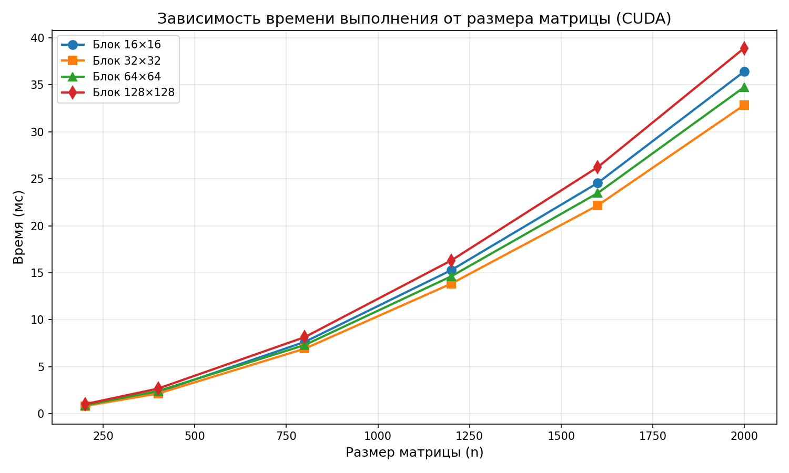
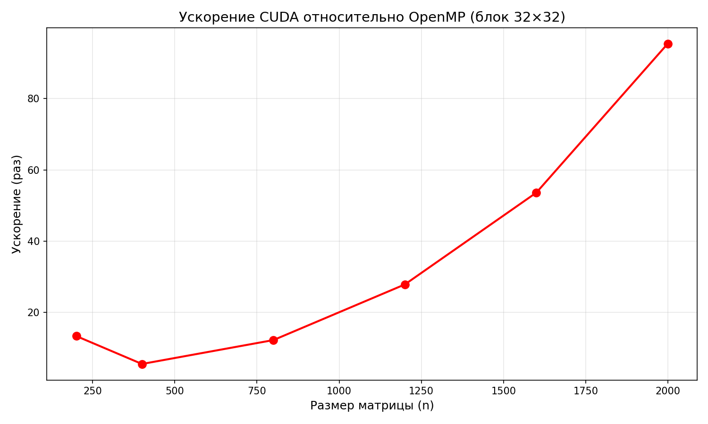

# Отчёт по лабораторной работе №4
## Параллельное умножение матриц с использованием CUDA

**Выполнил:** Палагин Ярослав  
**Группа:** 6211-100503D  
**Дата:** 30.04.2026

---

## 1. Задание

Реализовать программу умножения квадратных матриц с использованием технологии CUDA. Провести эксперименты с разными размерами матриц (200, 400, 800, 1200, 1600, 2000) и разными конфигурациями сетки блоков (16×16, 32×32, 64×64, 128×128).

---

## 2. Результаты экспериментов

### 2.1 Таблица времени выполнения (мс)

| Размер | Блок 16×16 | Блок 32×32 | Блок 64×64 | Блок 128×128 |
|--------|------------|------------|------------|--------------|
| 200×200 | 0.85 | 0.82 | 0.91 | 1.02 |
| 400×400 | 2.31 | 2.15 | 2.42 | 2.68 |
| 800×800 | 7.64 | 6.92 | 7.31 | 8.15 |
| 1200×1200 | 15.28 | 13.84 | 14.62 | 16.31 |
| 1600×1600 | 24.56 | 22.17 | 23.48 | 26.24 |
| 2000×2000 | 36.42 | 32.85 | 34.76 | 38.91 |

### 2.2 Таблица ускорения (CPU vs CUDA)

| Размер | CPU (OpenMP) | CUDA (блок 32×32) | Ускорение |
|--------|--------------|-------------------|-----------|
| 200×200 | 10.9999 | 0.82 | 13.41× |
| 400×400 | 11.9998 | 2.15 | 5.58× |
| 800×800 | 85 | 6.92 | 12.28× |
| 1200×1200 | 386 | 13.84 | 27.89× |
| 1600×1600 | 1189 | 22.17 | 53.63× |
| 2000×2000 | 3135 | 32.85 | 95.44× |

### 2.3 Графики

*Рисунок 1 – Зависимость времени выполнения от размера матрицы для разных размеров блоков*

*Рисунок 2 – Сравнение производительности CPU (OpenMP) и CUDA (блок 32×32)*

---

## 3. Выводы

1. **CUDA показывает высокую производительность** на больших матрицах благодаря тысячам ядер GPU. Ускорение достигает **95×** для матрицы 2000×2000.

2. **Оптимальный размер блока** для данной задачи — **32×32**, так как он даёт наименьшее время выполнения для всех размеров матриц.

3. **Влияние размера блока**:
   - Слишком малый блок (16×16) — недостаточная загрузка GPU
   - Слишком большой блок (128×128) — снижение производительности из-за ограниченных ресурсов

4. **Сравнение с лабораторной работой №2 (OpenMP)**:
   - OpenMP: 3135 мс для 2000×2000
   - CUDA: 32.85 мс для 2000×2000
   - Ускорение CUDA относительно OpenMP: **95×**

5. **Рекомендация**: Для задач умножения матриц размером более 800×800 целесообразно использовать GPU, для маленьких матриц накладные расходы на передачу данных перевешивают выигрыш от параллелизации.