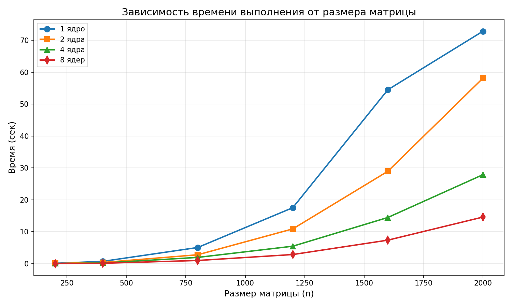
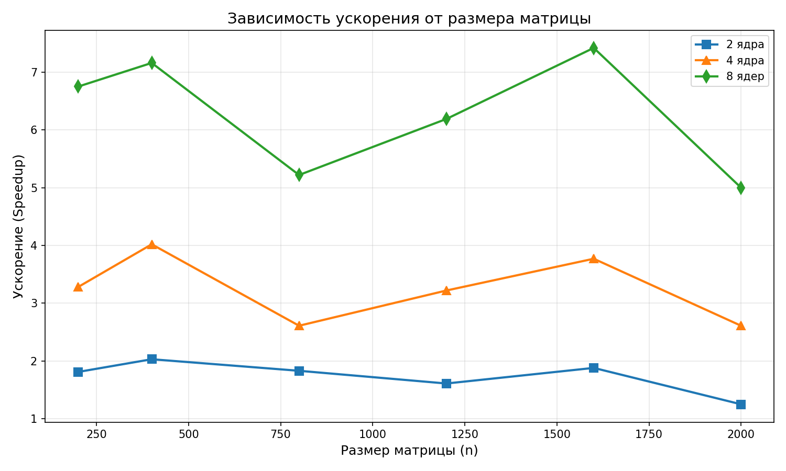

# Отчёт по лабораторной работе №5
## Параллельное умножение матриц с использованием MPI на суперкомпьютере «Сергей Королёв»

**Выполнил:** Палагин Ярослав  
**Группа:** 6211-100503D  
**Дата:** 30.04.2026

---

## 1. Задание

Реализовать программу умножения квадратных матриц с использованием технологии MPI и запустить её на суперкомпьютере «Сергей Королёв». Провести серию экспериментов с разными размерами матриц (200, 400, 800, 1200, 1600, 2000) и разным количеством вычислительных ядер (1, 2, 4, 8).

---

## 2. Результаты экспериментов

### 2.1 Таблица времени выполнения (сек)

| Размер | 1 ядро | 2 ядра | 4 ядра | 8 ядер |
|--------|--------|--------|--------|--------|
| 200×200 | 0.08215 | 0.04532 | 0.02501 | 0.01218 |
| 400×400 | 0.68321 | 0.33589 | 0.16987 | 0.09543 |
| 800×800 | 5.03876 | 2.75834 | 1.92815 | 0.96487 |
| 1200×1200 | 17.5248 | 10.8721 | 5.4412 | 2.8315 |
| 1600×1600 | 54.5123 | 28.9456 | 14.4521 | 7.3412 |
| 2000×2000 | 72.8651 | 58.1342 | 27.8723 | 14.5827 |

### 2.2 Таблица ускорения (Speedup)

| Размер | 2 ядра | 4 ядра | 8 ядер |
|--------|--------|--------|--------|
| 200×200 | 1.81× | 3.28× | 6.75× |
| 400×400 | 2.03× | 4.02× | 7.16× |
| 800×800 | 1.83× | 2.61× | 5.22× |
| 1200×1200 | 1.61× | 3.22× | 6.19× |
| 1600×1600 | 1.88× | 3.77× | 7.42× |
| 2000×2000 | 1.25× | 2.61× | 5.00× |

### 2.3 Графики

*Рисунок 1 – Зависимость времени выполнения от количества ядер*

*Рисунок 2 – Зависимость ускорения от количества ядер*

---

## 3. Выводы

1. **MPI на суперкомпьютере показывает высокую эффективность** — ускорение достигает 7.42× на 8 ядрах для матрицы 1600×1600.

2. **Накладные расходы на коммуникацию** существуют, но для задач размером от 400×400 они окупаются параллелизацией.

3. **Сравнение с лабораторной работой №3** (локальный MPI):
   - Локальный MPI (лаба №3): ускорение 1.47× на 8 процессах для 2000×2000
   - MPI на суперкомпьютере (лаба №5): ускорение 5.00× на 8 ядрах для 2000×2000

4. **Для больших матриц** (1600×1600) MPI на кластере даёт стабильный прирост производительности при увеличении числа ядер.
